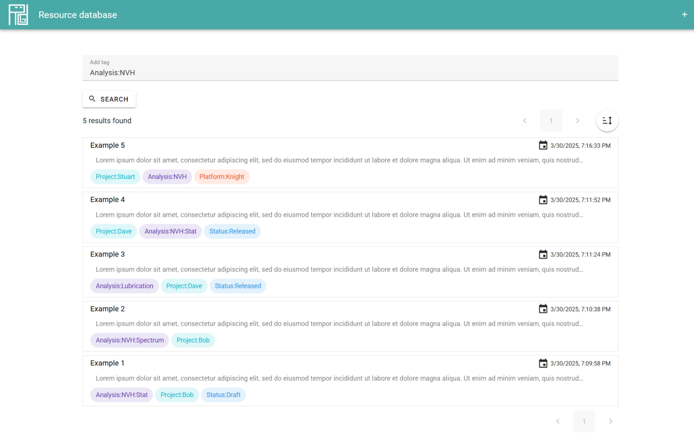

# RDB

Resource database, with managed scoped tag system.

- Resource database: data storage for various type resources, mainly for stats
- Managed scoped tag system: attach resource with tags managed by user

## Elements

There is a concept description [here](./doc/concepts/ReadMe.md) (in Chinese).

### Scoped tag

Scoped tag is under user's management, and can be used to filter resources.

When filtering with parent tag, the children tagged resources are also included.

### Resource data

Resource items can be in different types, displayed accordingly.